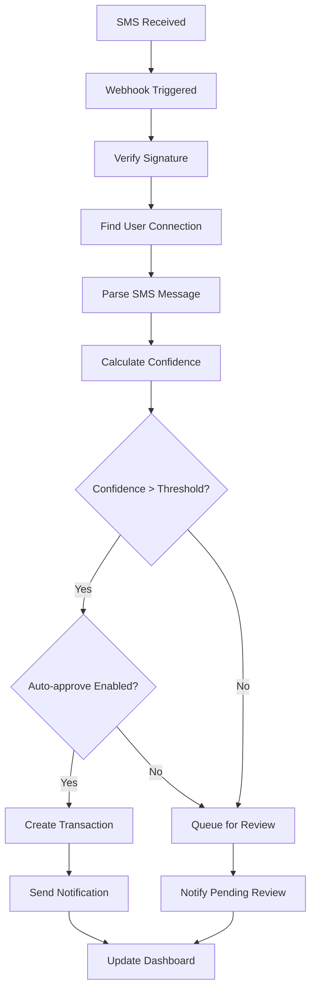

# Real-time SMS Integration Guide

## 🚀 Overview

The Real-time SMS Integration feature allows users to connect their phone numbers directly to the FinFlow system for automatic transaction processing. When users receive bank SMS messages, the system automatically extracts transaction data and adds it to their expense tracker in real-time.

## 🏗️ Architecture

### Components

1. **SMS Integration Service** (`lib/sms-integration.ts`)
   - Core service managing SMS connections and processing
   - Handles phone number registration and validation
   - Processes incoming SMS webhooks
   - Manages transaction creation and approval workflows

2. **Webhook Endpoint** (`/api/sms/webhook`)
   - Receives SMS messages from external SMS services
   - Validates webhook signatures for security
   - Processes SMS messages through the integration service

3. **Registration API** (`/api/sms/register`)
   - Phone number registration and management
   - Connection status monitoring
   - Settings updates and deactivation

4. **Pending Transactions API** (`/api/sms/pending`)
   - Manages transactions awaiting manual approval
   - Bulk approval and review functionality

5. **SMS Connect UI** (`/app/sms-connect`)
   - User interface for phone number registration
   - Connection management and settings
   - Real-time status monitoring

## 📱 How It Works

### 1. Phone Number Registration
```typescript
// User registers their phone number
const connection = await smsService.registerPhoneNumber(
  userId,
  phoneNumber,
  permissions: {
    readSMS: true,
    autoProcess: true,
    realTimeSync: true
  },
  settings: {
    autoApprove: false,
    minConfidence: 0.7,
    categories: [],
    excludeKeywords: []
  }
);
```

### 2. SMS Webhook Processing
```typescript
// Incoming SMS webhook
POST /api/sms/webhook
{
  "phoneNumber": "+919876543210",
  "message": "HDFC Bank: Rs.500.00 debited from A/C **1234...",
  "timestamp": "2023-12-15T10:30:00Z",
  "sender": "HDFCBK",
  "messageId": "msg_123456"
}
```

### 3. Automatic Transaction Creation
- SMS message is parsed using AI-powered parser
- Transaction confidence score is calculated
- High-confidence transactions are auto-approved (if enabled)
- Low-confidence transactions are queued for manual review

### 4. Real-time Updates
- Transactions appear in dashboard immediately
- Push notifications sent to user
- Calendar and analytics updated automatically

## 🔧 Integration Options

### Option 1: SMS Gateway Integration
Use a third-party SMS gateway service that supports webhooks:

**Recommended Services:**
- **Twilio**: Enterprise-grade SMS API with webhook support
- **MSG91**: Indian SMS service with webhook capabilities
- **TextLocal**: UK-based SMS service with API integration
- **AWS SNS**: Amazon's SMS service with Lambda integration

**Setup Process:**
1. Register with SMS gateway provider
2. Configure webhook URL: `https://your-app.vercel.app/api/sms/webhook`
3. Set up phone number forwarding
4. Configure webhook authentication

### Option 2: Android App Integration
Create a companion Android app that forwards SMS messages:

**Features:**
- Background SMS monitoring
- Selective forwarding (bank SMS only)
- End-to-end encryption
- Battery optimization

**Implementation:**
```kotlin
// Android SMS receiver
class SMSReceiver : BroadcastReceiver() {
    override fun onReceive(context: Context, intent: Intent) {
        val messages = Telephony.Sms.Intents.getMessagesFromIntent(intent)
        for (message in messages) {
            if (isBankSMS(message.originatingAddress, message.messageBody)) {
                forwardToWebhook(message)
            }
        }
    }
}
```

### Option 3: IFTTT/Zapier Integration
Use automation platforms for SMS forwarding:

**IFTTT Setup:**
1. Create applet: "If SMS received, then webhook"
2. Filter for bank SMS messages
3. Forward to FinFlow webhook endpoint

**Zapier Setup:**
1. Trigger: SMS received (via SMS parser)
2. Filter: Contains bank keywords
3. Action: Webhook to FinFlow API

## 🔒 Security Implementation

### Webhook Authentication
```typescript
// Verify webhook signature
async function verifyWebhookSignature(request: NextRequest, body: any): Promise<boolean> {
  const signature = request.headers.get('x-webhook-signature');
  const timestamp = request.headers.get('x-timestamp');
  const payload = JSON.stringify(body);
  
  // HMAC-SHA256 verification
  const expectedSignature = crypto
    .createHmac('sha256', process.env.SMS_WEBHOOK_SECRET!)
    .update(timestamp + payload)
    .digest('hex');
    
  return crypto.timingSafeEqual(
    Buffer.from(signature!, 'hex'),
    Buffer.from(expectedSignature, 'hex')
  );
}
```

### Data Protection
- **Encryption**: All SMS data encrypted in transit and at rest
- **Minimal Storage**: Only transaction data stored, not full SMS content
- **Access Control**: User-specific phone number registration
- **Audit Logging**: All SMS processing activities logged

### Privacy Compliance
- **Consent**: Explicit user consent for SMS access
- **Data Minimization**: Only transaction-related data extracted
- **Right to Delete**: Users can deactivate and delete all data
- **Transparency**: Clear disclosure of data usage

## 📊 Processing Flow



## 🎯 Configuration Options

### User Settings
```typescript
interface SMSSettings {
  autoApprove: boolean;           // Auto-approve high confidence transactions
  minConfidence: number;          // Minimum confidence threshold (0.5-1.0)
  categories: string[];           // Allowed categories for auto-processing
  excludeKeywords: string[];      // Keywords to exclude from processing
  maxDailyTransactions: number;   // Daily processing limit
  notificationPreferences: {
    realTime: boolean;            // Real-time notifications
    dailySummary: boolean;        // Daily summary emails
    weeklyReport: boolean;        // Weekly reports
  };
}
```

### System Configuration
```typescript
// Environment variables
SMS_WEBHOOK_API_KEY=your-webhook-api-key
SMS_WEBHOOK_SECRET=your-webhook-secret
SMS_PROCESSING_ENABLED=true
SMS_MAX_DAILY_LIMIT=100
SMS_CONFIDENCE_THRESHOLD=0.7
```

## 📈 Analytics & Monitoring

### Processing Metrics
- **Success Rate**: Percentage of successfully processed SMS
- **Confidence Distribution**: Histogram of confidence scores
- **Processing Time**: Average time from SMS to transaction
- **Error Rate**: Failed processing attempts

### User Metrics
- **Active Connections**: Number of users with active SMS monitoring
- **Daily Volume**: SMS messages processed per day
- **Auto-approval Rate**: Percentage of auto-approved transactions
- **Manual Review Queue**: Pending transactions awaiting approval

### Dashboard Widgets
```typescript
// SMS processing stats
const stats = {
  totalProcessed: 1250,
  thisMonth: 89,
  averageConfidence: 0.85,
  autoApprovalRate: 0.72,
  pendingReview: 5
};
```

## 🚨 Error Handling

### Common Scenarios
1. **Invalid SMS Format**: Log and skip processing
2. **Duplicate Transactions**: Detect and prevent duplicates
3. **Webhook Failures**: Retry mechanism with exponential backoff
4. **Rate Limiting**: Implement per-user processing limits
5. **Service Downtime**: Queue messages for later processing

### Error Recovery
```typescript
// Retry mechanism for failed processing
async function processWithRetry(smsPayload: SMSWebhookPayload, maxRetries = 3) {
  for (let attempt = 1; attempt <= maxRetries; attempt++) {
    try {
      return await smsService.processIncomingSMS(smsPayload);
    } catch (error) {
      if (attempt === maxRetries) throw error;
      await delay(Math.pow(2, attempt) * 1000); // Exponential backoff
    }
  }
}
```

## 🔮 Future Enhancements

### Planned Features
1. **Multi-language Support**: Support for regional language SMS
2. **Bank-specific Parsers**: Optimized parsers for specific banks
3. **Machine Learning**: Improve parsing accuracy with ML models
4. **Bulk Import**: Historical SMS import from phone backups
5. **Smart Categorization**: AI-powered category suggestions
6. **Spending Insights**: Real-time spending alerts and insights

### Advanced Integrations
1. **WhatsApp Business**: Transaction notifications via WhatsApp
2. **Email Integration**: Parse transaction emails alongside SMS
3. **UPI Integration**: Direct UPI transaction monitoring
4. **Bank API Integration**: Direct bank account connectivity
5. **Voice Assistant**: Voice-activated transaction queries

## 📞 Support & Troubleshooting

### Common Issues

**SMS Not Processing**
- Check webhook URL configuration
- Verify phone number registration
- Confirm SMS gateway connectivity

**Low Confidence Scores**
- Review SMS format compatibility
- Adjust confidence threshold
- Check for bank-specific patterns

**Duplicate Transactions**
- Verify duplicate detection logic
- Check transaction timing windows
- Review SMS forwarding settings

### Debug Mode
```typescript
// Enable debug logging
process.env.SMS_DEBUG_MODE = 'true';

// Debug webhook payload
console.log('Webhook received:', {
  phoneNumber: payload.phoneNumber,
  sender: payload.sender,
  messagePreview: payload.message.substring(0, 50) + '...'
});
```

## 📋 Deployment Checklist

### Pre-deployment
- [ ] Configure SMS webhook endpoint
- [ ] Set up webhook authentication
- [ ] Test SMS parsing accuracy
- [ ] Configure rate limiting
- [ ] Set up monitoring and alerts

### Production Setup
- [ ] Register webhook URL with SMS provider
- [ ] Configure environment variables
- [ ] Set up SSL certificates
- [ ] Enable error logging
- [ ] Configure backup systems

### Post-deployment
- [ ] Monitor webhook health
- [ ] Track processing metrics
- [ ] Gather user feedback
- [ ] Optimize parsing rules
- [ ] Scale infrastructure as needed

---

This real-time SMS integration transforms FinFlow into a truly automated expense tracking system, providing users with seamless transaction monitoring without manual data entry.